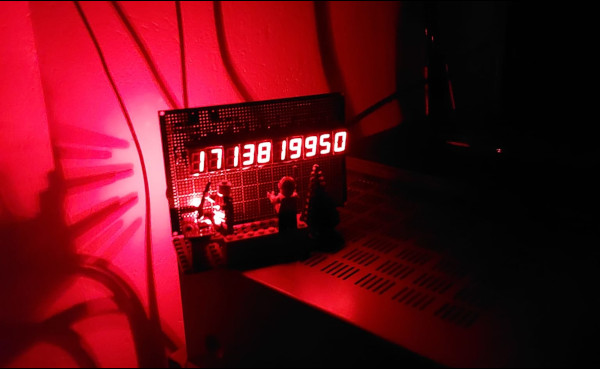
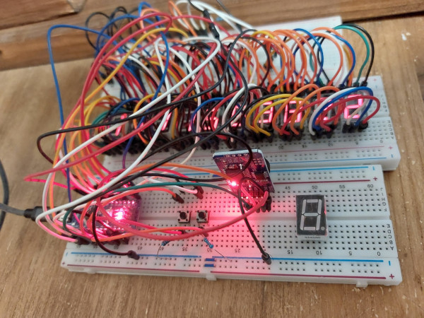
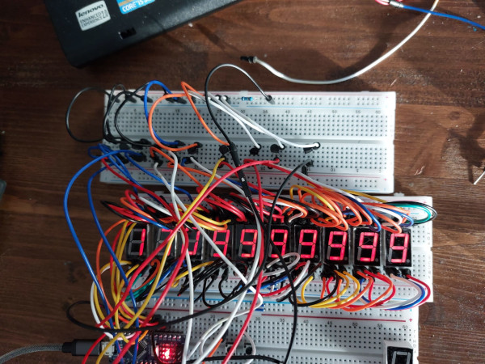

# Arduino Nano Unix Epoch Time Clock

This repository contains the code and schematic for building a Unix epoch time clock using an Arduino Nano and 10 7-segment displays.

## Project Description

This project allows you to display the current Unix epoch time on a series of 7-segment displays. The setup uses an Arduino Nano as the controller to drive the displays. Please note that this clock was built without any formal plan or detailed calculations—it was a more intuitive and experimental build.

## Important Notes

- **Build Process**: Since this project was constructed in an experimental manner, I highly recommend testing it on a breadboard before attempting a final build.
- **Pin Usage**: To control all 10 displays with a single Arduino Nano, I had to utilize nearly all available pins, including the RX/TX pins. If you've connected any of the displays to the RX/TX pins, make sure to **disconnect them before uploading the code** to the Arduino Nano. This will prevent any upload errors or issues.
- **Stability**: My clock has been running continuously for 6 months without any issues, so the design has proven to be stable over time.

## Getting Started

If you'd like to replicate this project, you'll need the following components:
- Arduino Nano
- 10x 7-segment displays
- 2x buttons
- 2x 10k Ohm resistors
- 1x 10 Ohm resistor
- 10x 2N2222 transistors
- 1x ds3231 rtc module

Follow the schematic provided to wire the components together. The code included in this repository will drive the displays and keep track of the Unix epoch time.

## Disclaimer

This project is intended for educational and experimental purposes. It may require further modifications and optimizations depending on your specific requirements.

---
